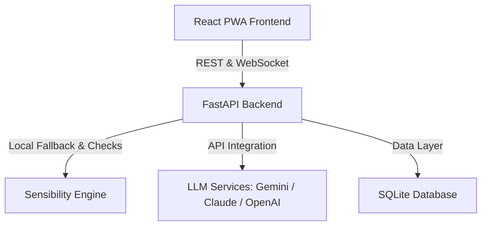

# Intervene AI: Educator Regulation Training

Intervene AI is a high-fidelity simulation engine designed to train educators in Behavior Skills Training (BST), co-regulation, validation, and limit-setting. Educators practice managing challenging student behaviors in real-time, receiving feedback based on clinical psychology frameworks.

The engine supports:
- **Interactive Scaffolding**: Structured multiple-choice dialogue paths.
- **Open-Ended Free-Form Practice**: Direct text entry validated by a **Sensibility Checking Engine** that detects keyboard smashes (gibberish) and off-topic conversations (irrelevant input).
- **Behavioral Personalization**: 4 distinct child behaviors ranging from hyperactive ADHD to escalated fight-or-flight crisis (Jax).
- **Immediate Coaching Reports**: Evaluations detailing Empathy & Validation scores, Limit-Setting clarity, and Response Trap analysis.

---

## Architecture Overview



---

## Native Installation Prerequisites

To run the platform locally, you must install the following runtimes natively on your host machine:

1. **Git**
   - Required for cloning the repository and version control.
   - **Download Link**: [Git Official Downloads](https://git-scm.com/downloads)

2. **Python 3.10 or higher**
   - Required for running the FastAPI web server.
   - **Download Link**: [Python Official Downloads](https://www.python.org/downloads/)
   
3. **Node.js (v18.x or v20.x LTS)**
   - Required for running the React/Vite development server.
   - **Download Link**: [Node.js Official Downloads](https://nodejs.org/en/download/)

4. **SQLite**
   - Used as the local data layer. It comes bundled natively with Python, so no external database engine installation is required.

---

## Quick Setup (Automated)

1. Clone the repository and navigate into the project directory:
   ```bash
   git clone https://github.com/mwarpinski/intervene_ai.git
   cd intervene_ai
   ```

2. Run the platform setup script to automatically configure both the backend and frontend:
   ```bash
   python3 setup.py
   ```

This script will:
- Detect your OS (Linux, macOS, Windows).
- Check that Python (>= 3.10) and Node.js are correctly installed.
- Initialize a Python virtual environment (`venv`) inside the backend directory.
- Install backend package dependencies.
- Copy `.env.example` to `.env` (if not already present).
- Run `npm install` in the frontend directory to set up React node packages.

---

## Step-by-Step Manual Setup (Alternative)

### 0. Clone the Repository

```bash
git clone https://github.com/mwarpinski/intervene_ai.git
cd intervene_ai
```

### 1. Set Up the Backend

1. Navigate to the `backend` directory:
   ```bash
   cd backend
   ```

2. Create a Python virtual environment:
   ```bash
   python3 -m venv venv
   ```

3. Activate the virtual environment:
   - **Linux/macOS**:
     ```bash
     source venv/bin/activate
     ```
   - **Windows**:
     ```bash
     .\venv\Scripts\activate
     ```

4. Install the backend dependencies:
   ```bash
   pip install -r requirements.txt
   ```

5. Create your `.env` configuration file:
   ```bash
   cp .env.example .env
   ```
   *Edit `.env` and fill in your LLM provider keys (optional; if left blank, the app defaults to the deterministic offline simulator):*
   ```env
   # API Keys for LLM Integration
   GEMINI_API_KEY=your-gemini-api-key
   ANTHROPIC_API_KEY=your-anthropic-api-key
   OPENAI_API_KEY=your-openai-api-key
   ```

### 2. Set Up the Frontend

1. Navigate to the `frontend` directory:
   ```bash
   cd ../frontend
   ```

2. Install Node.js dependencies:
   ```bash
   npm install
   ```

---

## Running the Application

Both the backend and frontend servers must run simultaneously for the application to function correctly. 

### Quick Run (One-Liner)

You can launch both the backend and frontend servers together using our single-command launcher script:

```bash
python3 run.py
```
*(Or `./run.py` on Linux/macOS)*

This script concurrently starts both services, forwards logs to your terminal, and listens for a `Ctrl+C` command to cleanly stop both servers (preventing orphaned processes).

---

### Manual Run (Alternative)

If you prefer to run them in separate terminals:

#### Start the FastAPI Backend
From the `backend` directory (with your virtual environment activated):
```bash
uvicorn app.main:app --host 127.0.0.1 --port 8000 --reload
```
- **Interactive OpenAPI Docs**: Available at [http://127.0.0.1:8000/docs](http://127.0.0.1:8000/docs)

#### Start the Vite Frontend
From the `frontend` directory:
```bash
npm run dev
```
- **Web App URL**: Opens at [http://localhost:5173/](http://localhost:5173/)

---

## Developer Guide: Sensibility & Behavioral Checkers

- **Keyboard Smash Filter**: Detects random sequences of letters (e.g., `asdfasdf`) using letter-frequency thresholds.
- **Irrelevance Filter**: Validates if the input is classroom-appropriate. Off-topic topics like cryptocurrency, trading, shopping, or sports trigger defensive, escalated reactions from the student personas.
- **LLM Prompt Syncing**: All base prompts include explicit rules directing live LLMs (Gemini, Claude, GPT) to mimic these dysregulated reactions when detecting nonsense inputs.
