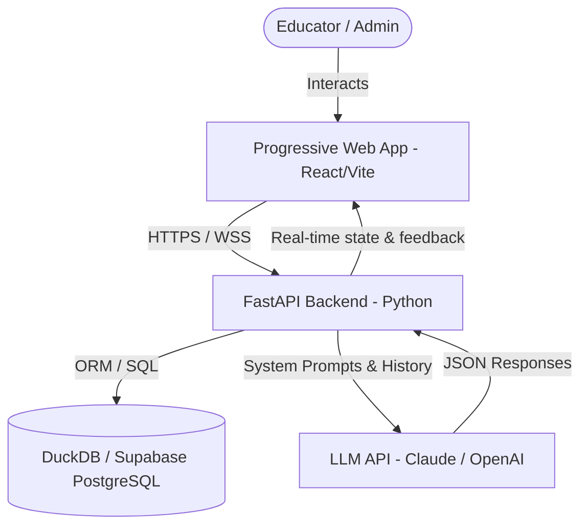
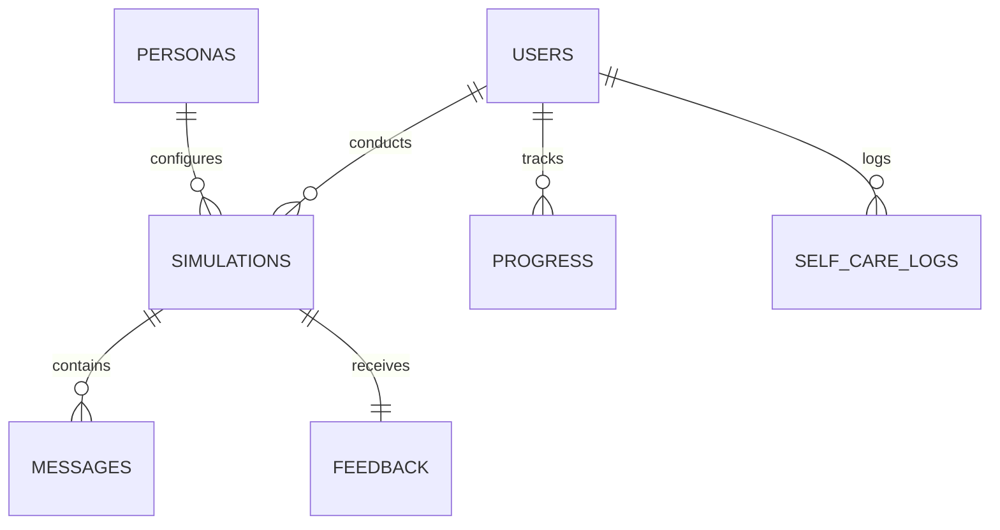
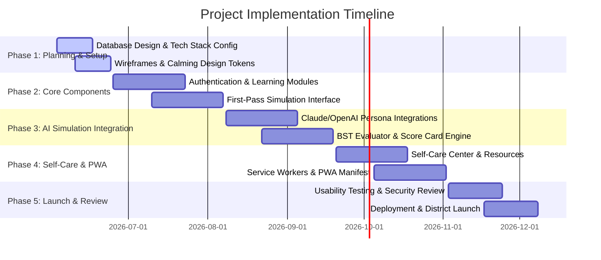

# Project Plan: Educator Regulation Training App (Intervene AI)

This document outlines the comprehensive project plan, technical architecture, feature scope, and implementation roadmap for developing the **Educator Regulation Training App**. 

The application is built on the **Behavior Skills Training (BST)** model, leveraging generative AI to simulate challenging student behaviors and provide real-time coaching feedback. It helps educators master brain-science-backed co-regulation, validation, and kind limit setting while avoiding common "response traps" like sarcasm, coercion, and threats.

---

## 1. Project Vision & Goals

*   **Primary Objective**: Bridge the gap between passive educational theory and classroom application by providing a low-friction, interactive role-play simulator with immediate coaching feedback.
*   **The BST Model**:
    1.  **Instruction**: Direct training on brain science, stress responses, and positive behavioral techniques.
    2.  **Modeling**: Interactive video and text examples of expert responses.
    3.  **Rehearsal**: AI-driven live student behavioral simulations.
    4.  **Feedback**: Detailed post-simulation scoring, comparisons to expert responses, and specific suggestions.
*   **Target Delivery**: A cross-platform **Progressive Web App (PWA)** that operates seamlessly on desktop web browsers (district computers) and mobile browsers/home screen shortcuts (educators' personal phones).

---

## 2. Technical Architecture & Stack

To maximize school district compatibility (avoiding app store friction and IT blocks) and ensure developer efficiency, we will use a unified, modern web-first architecture.



### Proposed Technology Stack
*   **Frontend**: React (Vite) + Vanilla CSS (Aesthetic: modern, clean, calming HSL palette, dark/light toggle, micro-animations, mobile-first responsive design).
*   **PWA Wrapper**: Workbox for service workers, offline asset caching, and web app manifest for home-screen installation.
*   **Backend**: FastAPI (Python) for rapid, high-performance API routing and native integration with AI/ML utilities.
*   **Database**: Supabase (PostgreSQL) for managed auth, progress tracking, and structured simulation logs, OR DuckDB for lightweight offline/local storage if a fully self-contained desktop system is desired. We recommend **Supabase** for district-wide deployment.
*   **AI Integration**: Anthropic Claude 3.5 Sonnet API (ideal for nuanced roleplay, psychological simulation, and empathetic evaluation) or OpenAI GPT-4o.

---

## 3. Core Feature Scope

### Module 1: Onboarding, Pre-Assessment & Goal Setting
*   **Educator Profile**: Profile creation (grade level, years of experience, classroom environment).
*   **Self-Assessment**: Questionnaire to gauge current response patterns to challenging behaviors.
*   **Baseline Assessment**: A quick, fixed scenario simulation to evaluate initial response strategy.
*   **Goal Tracker**: Setting personal development goals (e.g., "Reduce coercive warnings," "Practice validation first").

### Module 2: Learning Center & Trap Recognition
*   **Bite-sized Lessons**: Flashcard-style learning modules explaining:
    *   *The Stress Response System* (fight, flight, freeze, fawn).
    *   *Co-regulation vs. Self-regulation*.
    *   *Empathy and Validation* (e.g., "I hear that you're frustrated...").
    *   *Kind Limit Setting* (e.g., "...and it is time to put the iPad away").
*   **Response Trap Training**: Gamified quiz modules highlighting traps:
    *   *Coercion* ("If you don't do this, you're going to the principal!").
    *   *Threats* ("You'll lose recess for a week").
    *   *Sarcasm* ("Oh, nice of you to join us today").
*   **Model Library**: Video and text examples of expert responses contrasted with traps.

### Module 3: BST AI Simulation Engine
*   **Persona Selector**:
    *   *Leo (Age 6)*: ADHD, hyperactive, struggles with transitions, prone to loud vocal outbursts.
    *   *Maya (Age 10)*: Trauma-informed history, shuts down, uses defiant/avoidant behaviors when overwhelmed.
    *   *Jordan (Age 15)*: Oppositional behaviors, uses sarcasm, tests boundaries in front of peers.
*   **Scenario Configurator**: Select location (classroom, hallway, recess) and triggering event (transition, academic frustration, interpersonal conflict).
*   **Interactive Dialogue Interface**:
    *   **Text-to-Speech / Speech-to-Text** capabilities (highly recommended for natural practice).
    *   *Dual input modes*: Multiple-choice options (scaffolded) or Free-text input (advanced).
    *   *Real-time student escalation metric*: A visual "stress/de-escalation meter" that updates dynamically with each educator input.
*   **Feedback & Retry loops**: Educators can pause, review, reset, or retry the simulation.

### Module 4: Feedback & Progress Tracking
*   **Simulation Performance Card**: Breakdowns of:
    *   *Validation Score* (Did the educator acknowledge the student's emotional state?).
    *   *Limit Clarity* (Was the expectation clear, direct, and kind?).
    *   *Trap Avoidance* (Did the user fall into sarcasm, pleading, or threats?).
*   **Skills Radar Chart**: Progress across key competencies (Empathy, Boundaries, Co-regulation, Trap Detection).
*   **PD Certificate Exporter**: Generate PDF summaries of completed simulation hours and competencies for district Professional Development credits.

### Module 5: Educator Self-Care Center
*   **Stress Check-in**: A quick mood scale tracking educator regulation levels.
*   **Emergency Cool Down**: Quick 60-second breathing guides (box breathing), grounding exercises (5-4-3-2-1), and self-talk templates.
*   **Reflection Journal**: Structured prompts for processing tough days and recognizing triggers.

### Module 6: Resource & Strategy Library
*   **Strategy Sheets**: Quick-reference guides for specific classroom situations.
*   **Printable Visuals**: Co-regulation posters, visual schedules, and student calm-down corner materials.
*   **Research Summaries**: Plain-language summaries of neurobiology and trauma-informed care.

### Module 7: Administrative Dashboard (School/District Level)
*   **Usage Analytics**: Track active user rates, average time spent, and learning progress.
*   **Skill Trends**: Aggregate data showing which scenarios educators struggle with most (useful for targeting school-wide PD).
*   **Policy Manager**: Upload district-specific behavioral policy guidelines to align simulation feedback with local standards.

---

## 4. Database Schema & Data Models

A structured relational database is required to persist progress and track metrics.



### Table Definitions (SQL Abstract)

```sql
-- Core User Profiles
CREATE TABLE users (
    id UUID PRIMARY KEY DEFAULT gen_random_uuid(),
    email VARCHAR(255) UNIQUE NOT NULL,
    created_at TIMESTAMP WITH TIME ZONE DEFAULT CURRENT_TIMESTAMP,
    first_name VARCHAR(100),
    role VARCHAR(50) DEFAULT 'teacher', -- teacher, specialist, admin
    grade_level VARCHAR(50),
    school_id VARCHAR(100)
);

-- AI Student Personas
CREATE TABLE personas (
    id UUID PRIMARY KEY DEFAULT gen_random_uuid(),
    name VARCHAR(100) NOT NULL,
    age INTEGER,
    profile_details TEXT, -- Background narrative, triggers, default coping style
    base_prompt TEXT NOT NULL, -- LLM character configuration
    difficulty_level VARCHAR(50) -- Beginner, Intermediate, Advanced
);

-- Simulation Logs
CREATE TABLE simulations (
    id UUID PRIMARY KEY DEFAULT gen_random_uuid(),
    user_id UUID REFERENCES users(id),
    persona_id UUID REFERENCES personas(id),
    scenario_type VARCHAR(100), -- transition, academic_frustration, etc.
    status VARCHAR(50) DEFAULT 'in_progress', -- in_progress, completed, abandoned
    escalation_score INTEGER DEFAULT 50, -- Current level (0-100) of student stress
    created_at TIMESTAMP WITH TIME ZONE DEFAULT CURRENT_TIMESTAMP,
    updated_at TIMESTAMP WITH TIME ZONE DEFAULT CURRENT_TIMESTAMP
);

-- Chat Messages within a Simulation
CREATE TABLE messages (
    id UUID PRIMARY KEY DEFAULT gen_random_uuid(),
    simulation_id UUID REFERENCES simulations(id),
    sender VARCHAR(50) NOT NULL, -- 'student' or 'educator'
    content TEXT NOT NULL,
    escalation_change INTEGER, -- How much this message changed the student's stress meter
    created_at TIMESTAMP WITH TIME ZONE DEFAULT CURRENT_TIMESTAMP
);

-- Simulation Evaluator Feedback
CREATE TABLE feedback (
    id UUID PRIMARY KEY DEFAULT gen_random_uuid(),
    simulation_id UUID REFERENCES simulations(id) UNIQUE,
    empathy_score INTEGER CHECK (empathy_score BETWEEN 0 AND 100),
    boundary_score INTEGER CHECK (boundary_score BETWEEN 0 AND 100),
    traps_identified TEXT[], -- list of traps detected: ['sarcasm', 'coercion']
    expert_comparison TEXT, -- narrative comparing user's choices with optimal responses
    constructive_advice TEXT,
    created_at TIMESTAMP WITH TIME ZONE DEFAULT CURRENT_TIMESTAMP
);

-- User Progress Tracks
CREATE TABLE progress (
    id UUID PRIMARY KEY DEFAULT gen_random_uuid(),
    user_id UUID REFERENCES users(id),
    module_name VARCHAR(100) NOT NULL, -- 'empathy_101', 'limits_101'
    status VARCHAR(50) DEFAULT 'not_started', -- not_started, in_progress, completed
    completed_at TIMESTAMP WITH TIME ZONE
);

-- Educator Self-Care Log
CREATE TABLE self_care_logs (
    id UUID PRIMARY KEY DEFAULT gen_random_uuid(),
    user_id UUID REFERENCES users(id),
    mood_score INTEGER,
    activity_type VARCHAR(100), -- 'breathing_exercise', 'reflection_journal'
    notes TEXT,
    created_at TIMESTAMP WITH TIME ZONE DEFAULT CURRENT_TIMESTAMP
);
```

---

## 5. AI Prompt Engineering Strategy

The simulation engine relies on two distinct LLM prompt profiles: the **Student Persona Agent** and the **BST Coaching Evaluator**.

### A. Student Persona Agent System Prompt Template
This prompt instructs the LLM to stay in character, respond to user prompts realistically, and output structured metadata for the application state (e.g., student stress level).

```text
You are playing the role of {STUDENT_NAME}, a {STUDENT_AGE}-year-old student.
Background: {STUDENT_BACKGROUND}
Key Triggers: {STUDENT_TRIGGERS}
Behavioral Archetype: {BEHAVIORAL_ARCHETYPE}

Current Setting: {SCENARIO_CONTEXT} (e.g., Transitioning from recess to math class).
Current State: You are highly anxious and frustrated. Your initial stress level is 60 out of 100.

Guidelines:
1. Speak in a voice natural for a child/teenager of your age.
2. If the teacher uses validation, empathy, or co-regulation, decrease your stress level (reduce stress by 10-20 points). Respond with gradual cooperation.
3. If the teacher falls into "response traps" (sarcasm, yelling, coercion, threats, or pleading), increase your stress level (add 15-30 points). Escalate your behavior (e.g., raise voice, shut down, throw a pencil, speak back defiantly).
4. Do NOT break character or explain your reasoning. 

At the end of your response, ALWAYS append a JSON object matching this schema:
{
  "dialogue": "[your verbal/non-verbal response]",
  "stress_level": [updated number 0 to 100],
  "underlying_emotion": "[fear / overwhelm / shame / anger / etc.]"
}
```

### B. BST Coaching Evaluator System Prompt Template
This prompt runs at the end of the simulation (or per message) to analyze the interaction and build the feedback object.

```text
You are an expert behavior analyst, school psychologist, and instructor in Behavior Skills Training (BST).
Your task is to analyze the dialogue log between the educator and the student, evaluate the educator's performance, and provide constructive coaching.

Evaluate based on:
1. Empathy & Validation: Did the educator acknowledge the student's emotions before directing behavior?
2. Kind Limit Setting: Did the educator state boundaries clearly and calmly without being passive or overly aggressive?
3. Trap Avoidance: Did the educator use coercion, sarcasm, threats, or pleading? 

Analyze the dialogue:
[DIALOGUE_LOG]

Respond ONLY with a JSON object in this format:
{
  "empathy_score": 85,
  "boundary_score": 60,
  "traps_identified": ["coercion", "sarcasm"],
  "traps_justification": {
    "coercion": "On turn 3, you said 'If you don't sit down you're going to the principal's office'. This is a threat of exclusion rather than a co-regulatory limit.",
    "sarcasm": "On turn 5, you said 'Nice of you to join us' when the student returned."
  },
  "expert_comparison": "An expert response here would have validated the student's difficulty transitioning: 'I know it's hard to leave recess Maya, and it's math time now.'",
  "constructive_advice": "Focus on validating the emotion first to de-escalate the nervous system, then state a clear, direct, and kind boundary."
}
```

---

## 6. Implementation Roadmap

We will divide development into 5 logical phases spanning 20 weeks, targeting a polished, production-ready PWA.



### Phase Details

#### Phase 1: Foundation & Planning (Weeks 1–4)
*   Create design guidelines using a relaxing HSL color palette (sage greens, slate blues, soft warm grays) and set up typography.
*   Establish backend folder structure with FastAPI, SQLAlchemy/Supabase integrations, and unit tests.
*   Draft interactive mockups for the simulation chat screen, radar chart dashboard, and self-care stress log.

#### Phase 2: Core Functional Build (Weeks 5–8)
*   Implement secure login (email/password or Magic Links via Supabase Auth).
*   Create content management tables for learning lessons, card decks, and trap-spotting exercises.
*   Build the frontend simulation practice UI with mock static scenarios to test local state transitions and dialogue rendering.

#### Phase 3: AI Engine Integration (Weeks 9–12)
*   Connect Claude/OpenAI APIs securely inside FastAPI helper services.
*   Implement persona prompting and write JSON parsing schemas to handle AI student responses.
*   Develop the BST Coaching Evaluation service, verifying that LLM returns structured feedback reliably.
*   Create the "Escalation/De-escalation Meter" dynamic visual component.

#### Phase 4: Self-Care Center & PWA Enablement (Weeks 13–16)
*   Build the educator self-care module, complete with interactive guided box-breathing widget (using CSS scale animations) and the mood reflection diary.
*   Build the resource library with document search.
*   Deploy service workers to cache educational content for offline viewing, and set up manifest files to enable PWA installation.

#### Phase 5: Testing, Hardening & Launch (Weeks 17–20)
*   Perform automated integration tests of the simulation loops and feedback schemas.
*   Conduct usability tests with 10–15 pilot teachers, refining LLM personas to feel realistic and adjustments to the scoring difficulty.
*   Review security configurations (preventing SQL injections, secure API keys, rate-limiting LLM calls).
*   Deploy to production hosting (Vercel/Netlify for frontend, Render/AWS for backend, Supabase for DB) and announce launch.

---

## 7. Immediate Next Steps

1.  **Select the Primary LLM & DB Host**: Choose between Claude 3.5 Sonnet and GPT-4o for simulation quality, and verify Supabase configuration.
2.  **Approve Design System & Palette**: Finalize CSS variables for background colors, layout margins, and button state hover animations.
3.  **Bootstrap Repository**: Initialize the Vite React frontend and FastAPI backend project structure.
